* Image showing the altschool directory  
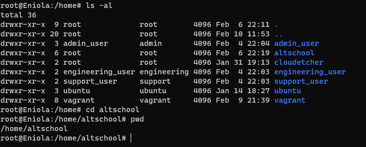

* showing sub-directories under altschool  
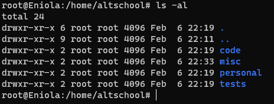

* a.Change directory to the tests directory using absolute pathname  
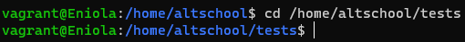

* b.Change directory to the tests directory using relative pathname  
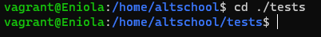

* c.Use echo command to create a file named fileA with text content ‘Hello A’ in the misc directory  
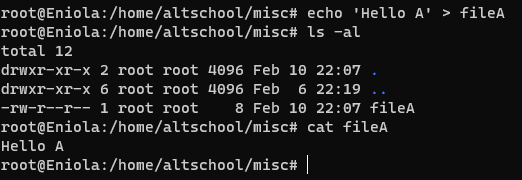

* d.Create an empty file named fileB in the misc directory  
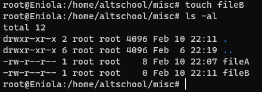

* e.Copy contents of fileA into fileC  
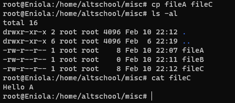

* f.Move contents of fileB into fileD  
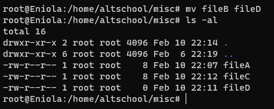

* g.Create a tar archive called misc.tar for the contents of misc directory  
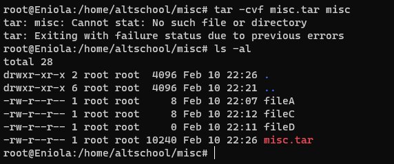

* h.Compress the tar archive to create a misc.tar.gz file  
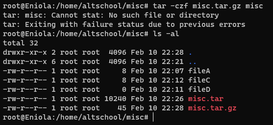

* i. Create a user and force the user to change his/her password upon login  
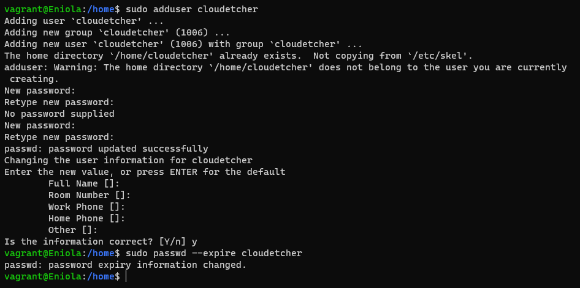

* j. Lock a users password  
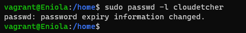

* k. Create a user with no login shell  
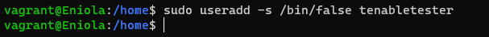

* l. Disable password based authentication for ssh  
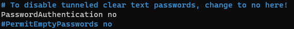

* m. Disable root login  
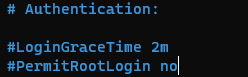